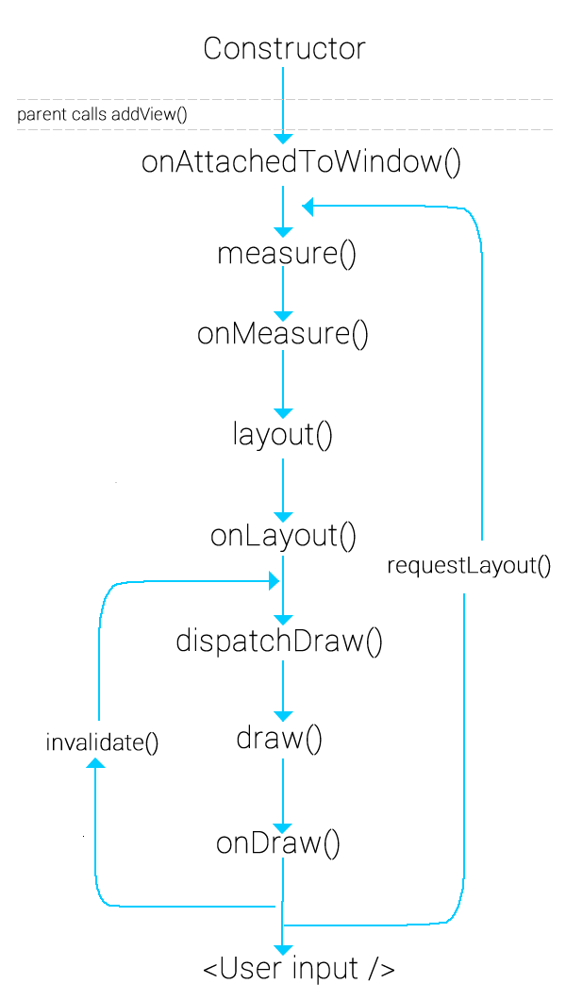

# CustomView

## Vòng đời của view

Cũng như Activity, Fragment View cũng có vòng đời của mình:


## Constructor

1. View(Context context)constructor này sẽ được sử dụng khi mà chúng ta add view lúc runtime.
2. View(Context context, AttributeSet attrs) constructor này sẽ được sử dụng khi chúng ta khai báo view trong XML (file layout xml á).
3. View(Context context, AttributeSet attrs, int defStyleAttr) cũng dùng trong XML nhưng thêm 1 tham số đó là các thuộc tính style của theme mặc định.
4. View(Context context, AttributeSet attrs, int defStyleAttr, int defStyleRes) như cái 3 nhưng có thêm tham số để truyền style riêng thông qua resource.

## Attribute 

Để xác định các thành phần đó ta sử dụng cái AttributeSet ý, và khởi tạo nó qua file attrs.xml:
```xml
<?xml version="1.0" encoding="utf-8"?>
<resources>
    <declare-styleable name="MyView">
        <attr name="myview_radius" format="dimension" />
      

        <attr name="myview_colo" format="color" />
      
    </declare-styleable>
</resources>
```

## onMeasure

Hàm này dùng để xác định kích thước View:

```java
protected void onMeasure(int widthMeasureSpec, int heightMeasureSpec) {
      int widthMode = MeasureSpec.getMode(widthMeasureSpec);
      int widthSize = MeasureSpec.getSize(widthMeasureSpec);
      int heightMode = MeasureSpec.getMode(heightMeasureSpec);
      int heightSize = MeasureSpec.getSize(heightMeasureSpec);

      //desiredWidth: dựa vào nội dung muốn hiển thị mà bạn sẽ tính ra bạn cần tối thiểu bao nhiêu
      //không gian để bạn hiển thị
      ...
      int width;
      if (widthMode == MeasureSpec.EXACTLY) {
          width = widthSize;
      } else if (widthMode == MeasureSpec.AT_MOST) {
          width = Math.min(desiredWidth, widthSize);
      } else {
          width = desiredWidth;
      }
      ...
}
```

- MeasureSpec.EXACTLY: điều này nghĩa là chúng ta đã xác định cứng kích thước trong xml, như kiểu layout_width=300dp.
- MeasureSpec.AT_MOST: không nên vượt quá giới hạn này, vậy nên mới sử dụng câu lệnh Math.min(desiredWidth, widthSize).
- MeasureSpec.UNSPECIFIED: cho bạn thỏa sức, nhưng chúng ta chỉ cần những gì chúng ta thực sự cần mà thôi width = desiredWidth.

Sau khi view con tính toán xong việc nó cần kích thước như thế nào thì gọi đến method setMeasuredDimension để xác nhận, view cha sẽ nhận được thông tin đó và sẽ còn phải tính toán thêm vài lần nữa mới kết thúc.

## onLayout

Tại phương thức này thì mọi chuyện đã xong, kích thước đã được set cho tất cả các view con, lúc này chúng ta dùng lệnh getWidth, getHeight thì mới có giá trị, chứ ở các method trước chưa tính toán xong thì chỉ có = 0 

## onDraw

Đây là hàm mà ta có thể dùng canvas để vẽ

## View update
gọi hàm invalidate() sua khi thay đổi để update lại View

# Paint
## Giới thiệu đối tượng Paint
- Paint trong java dùng để định nghĩa size, color, kiểu nét vẽ mà chúng ta sẽ sử dụng để vẽ bởi canvas (truyền vào method cavas.draw… trong phương thức onDraw của View).
## Các method của class Paint
- Trước tiên chúng ta có 2 cách khởi tạo Paint
## Cách 1: Contructor không có đối số
```java
    Paint mPaint = new Paint();
```
## Cách 2: Contructor có hai đối số
```java
    Paint mPaint = new Paint(Paint.ANTI_ALIAS_FLAG);
```
- khi sử dụng hàm này khi vẽ sẽ được khử răng cưa

## Và dưới đây là các phương thức được sử dụng phổ biến.
```java
//Set màu cho nét vẽ.
    setColor(int color); 
    

// Set giá trị Alpha cho nét vẽ. Chỉ chấp nhận các giá trị từ 0 đến 255. Thường sử dụng để làm animation fade in và fade out.
setAlpha(int a);

// Set giá trị độ rộng của net vẽ.
setStrokeWidth(float width);

//Set style cho nét vẽ. Có ba giá trị như sau:
setStyle(Style style); 

Paint.Style.FILL: Kiểu này dùng để tô đối tượng, ví dụ như tô hình tròn, elip, oval.

Paint.Style.STROKE. Kiểu này dùng để vẽ đường. ví dụ như vẽ đường tròn mà không có tô.

Paint.Style.FILL_AND_STROKE:Kiểu vừa vẻ vừa tô.


//Set style vẽ ở những điểm kết thúc của hai đường thẳng và có những giá trị sau:
setStrokeCap(Cap cap); 

Cap.ROUND: Bo tròn nét vẽ ở hai đầu mút của đoạn thẳng.

Cap.SQUARE: Vẽ nét vẽ bình thường. Nét vẽ sẽ sắc cạch ở hai đầu mút của đoạn thẳng.

//setStyle vẽ ở các điểm nối
setStrokeJoint(Joint joint)
Joint.BEVEL: Các cạnh bên ngoài của một liên kết gặp một đường thẳng
Joint.MITER: Các cạnh bên ngoài của một liên kết gặp nhau ở một góc sắc nét (Đây là chế độ mặc định)
Joint.ROUND: Các cạnh bên ngoài của một liên kết gặp nhau trong một vòng cung tròn. 

// Set kiểu phong cho nét vẽ, sử dụng trong trường hợp chúng ta muốn vẽ text.
setTypeface(Typeface typeface); 


//set font size cho nét vẽ, sử dụng trong trường hợp vẽ text.
setTextSize(float textSize); 


```
#Canvas

**drawArc**

```java
public void drawArc (float left, 
                float top, 
                float right, 
                float bottom, 
                float startAngle, 
                float sweepAngle, 
                boolean useCenter, 
                Paint paint)
 ```
                
Draw the specified arc, which will be scaled to fit inside the specified oval.

Vẽ vòng cung đã chỉ định, sẽ được chia tỷ lệ cho vừa với hình bầu dục đã chỉ định.

Nếu góc bắt đầu âm hoặc> = 360, góc bắt đầu được coi là góc bắt đầu modulo 360.

Nếu góc quét là> = 360, thì hình bầu dục được vẽ hoàn toàn. Lưu ý rằng điều này khác một chút so với SkPath :: arcTo, xử lý góc quét modulo 360. Nếu góc quét là âm, góc quét được coi là modulo góc quét 360

Vòng cung được vẽ theo chiều kim đồng hồ. Góc 0 độ tương ứng với góc hình học 0 độ (3 giờ trên đồng hồ.)

**drawBitmap**
```java
    public void drawBitmap (Bitmap bitmap, 
                float left, 
                float top, 
                Paint paint)
```
Vẽ bitmap đã chỉ định, với góc trên cùng / bên trái của nó tại (x, y), sử dụng sơn được chỉ định, được biến đổi bởi ma trận hiện tại.

**drawCircle**
```java
public void drawCircle (float cx, 
                float cy, 
                float radius, 
                Paint paint)
```
Vẽ vòng tròn đã chỉ định bằng cách sử dụng Paint được chỉ định có tâm (cx,cy) bán kính (radius). Nếu bán kính là <= 0, thì sẽ không có gì được vẽ ra. Vòng tròn sẽ được lấp đầy hoặc đóng khung dựa trên Phong cách trong Paint.

**drawLine**
```java
public void drawLine (float startX, 
                float startY, 
                float stopX, 
                float stopY, 
                Paint paint)
```
vẽ đường thẳng từ điểm start đến stop

**drawOval**
```java
public void drawOval (float left, 
                float top, 
                float right, 
                float bottom, 
                Paint paint)
```
vẽ hình Oval với kích thước chiều ngang (right - left), chiều cao (bottom - top)


**drawPath**
```java
public void drawPath (Path path, 
                Paint paint)
```
Vẽ theo đường dẫ Path


**drawText**
```java
public void drawText (CharSequence text, 
                int start, 
                int end, 
                float x, 
                float y, 
                Paint paint)
```
Vẽ phạm vi văn bản đã chỉ định, được chỉ định bởi start / end, với gốc của nó tại (x, y), trong Paint được chỉ định. 

**save**
hàm này sẽ lưa Matrix hiện tại
**restore**
hàm này sẽ sét Matrix thành Matrix đã lưu cuối cùng
#Path
Lớp Path đóng gói các đường dẫn hình học hỗn hợp (nhiều đường viền) bao gồm các đoạn thẳng, đường cong bậc hai và đường cong hình khối. Nó có thể được vẽ bằng canvas.drawPath(path, paint), được điền hoặc vuốt (dựa trên Phong cách của sơn) hoặc có thể được sử dụng để cắt hoặc vẽ văn bản trên đường dẫn.

Các hàm để thêm hình nối tiêp tương tự các hàm vẽ ở trên điểm khác biệt là điểm đầu của hình mới vẽ là điểm vẽ cuối của hình hiện tại

ngoài ra Path thêm một số hàm cần quan tâm
**quadTo**
```java
public void quadTo (float x1, 
                float y1, 
                float x2, 
                float y2)
```
Thêm một bezier bậc hai từ điểm cuối cùng, tiếp cận điểm kiểm soát (x1, y1) và kết thúc tại (x2, y2). Nếu không có lệnh gọi moveTo () nào được thực hiện cho đường viền này, điểm đầu tiên sẽ tự động được đặt thành (0,0)

**cubicTo**
```java
public void cubicTo (float x1, 
                float y1, 
                float x2, 
                float y2, 
                float x3, 
                float y3)
```
Thêm một khối vuông từ điểm cuối cùng, tiếp cận các điểm kiểm soát (x1, y1) và (x2, y2) và kết thúc tại (x3, y3). Nếu không có lệnh gọi moveTo () nào được thực hiện cho đường viền này, điểm đầu tiên sẽ tự động được đặt thành (0,0).
